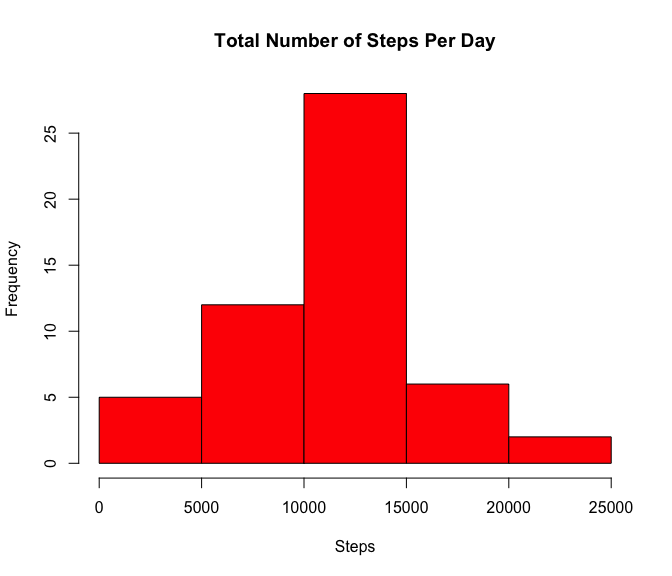
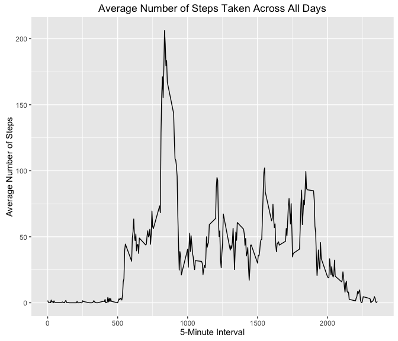
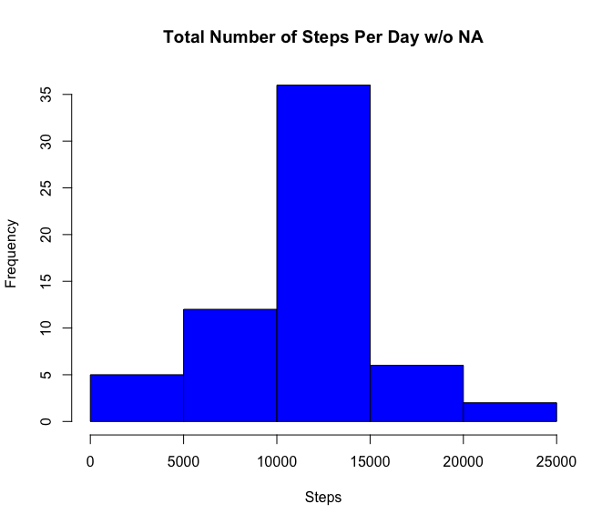
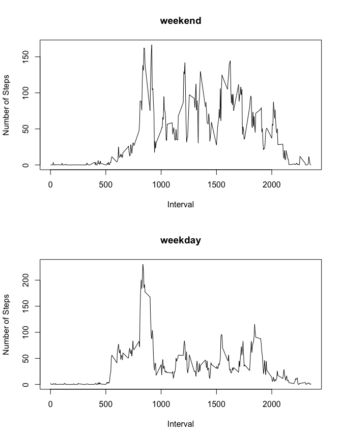

# Reproducible Research: Peer Assessment 1


## Loading and preprocessing the data

```r
activity <- read.csv("activity.csv", header = TRUE)
activity$date <- strptime(as.character(activity$date), format = "%Y-%m-%d") 
activity$date <- format(as.Date(activity$date), "%Y-%m-%d")

#omit NA
activity_na_omit <- na.omit(activity)
```

## What is mean total number of steps taken per day?

```r
#Calculate the total number of steps taken per day
steps <- aggregate(steps ~ date, activity_na_omit, sum)

#Make a histogram of the total number of steps taken each day
hist(steps$steps, xlab = "Steps",
     main = "Total Number of Steps Per Day", col = "red")
```

<!-- -->

```r
#Calculate and report the mean and median of the total number of steps taken per day
mean <- mean(steps$steps)
median <- median(steps$steps)

output <- paste("The mean of the total number of steps is", mean, "and the median is", median)
print(output)
```

```
## [1] "The mean of the total number of steps is 10766.1886792453 and the median is 10765"
```

## What is the average daily activity pattern?

```r
library(plyr)
```

```
## Warning: package 'plyr' was built under R version 3.2.5
```

```r
library(ggplot2)
```

```
## Warning: package 'ggplot2' was built under R version 3.2.4
```

```r
#Make a time series plot (i.e. type = "l") of the 5-minute interval (x-axis) and the average number of steps taken, averaged across all days (y-axis)
table_mean <- ddply(activity_na_omit, ~interval, summarize, mean = mean(steps))

qplot(x=interval, y=mean, data = table_mean,  geom = "line",
      xlab="5-Minute Interval",
      ylab="Average Number of Steps",
      main="Average Number of Steps Taken Across All Days"
      )
```

<!-- -->

```r
#Which 5-minute interval, on average across all the days in the dataset, contains the maximum number of steps?
max <- subset(table_mean, table_mean$mean == max(table_mean$mean))

output2 <- paste("The 5-minute interval that contains the maximum number of steps is", max$interval, "which has a mean of", max$mean)
print(output2)
```

```
## [1] "The 5-minute interval that contains the maximum number of steps is 835 which has a mean of 206.169811320755"
```


## Imputing missing values


```r
# Calculate and report the total number of missing values in the dataset (i.e. the total number of rows with NAs)
na_rows <- sum(!complete.cases(activity))

output3 <- paste("The total number of missing values is", na_rows)
print(output3)
```

```
## [1] "The total number of missing values is 2304"
```

```r
#Devise a strategy for filling in all of the missing values in the dataset. The strategy does not need to be sophisticated. For example, you could use the mean/median for that day, or the mean for that 5-minute interval, etc.

print("Use mean for the 5-minute interval as NA replacement")
```

```
## [1] "Use mean for the 5-minute interval as NA replacement"
```

```r
#Create a new dataset that is equal to the original dataset but with the missing data filled in.
activity_no_null <- activity 
for(i in 1:length(activity_no_null$steps)){
  if(is.na(activity_no_null$steps[i]) == TRUE) {
    activity_no_null$steps[i] <- table_mean$mean[table_mean$interval %in% activity_no_null$interval[i]] 
  }
}

#Make a histogram of the total number of steps taken each day and Calculate and report the mean and median total number of steps taken per day. 
steps2 <- aggregate(steps ~ date, activity_no_null, sum)
hist(steps2$steps, xlab = "Steps",
     main = "Total Number of Steps Per Day w/o NA", col = "blue")
```

<!-- -->

```r
mean2 <- mean(steps2$steps)
median2 <- median(steps2$steps)

output4 <- paste("The mean of the total number of steps is", mean2, "and the median is", median2)
print(output4)
```

```
## [1] "The mean of the total number of steps is 10766.1886792453 and the median is 10766.1886792453"
```

```r
#Do these values differ from the estimates from the first part of the assignment? What is the impact of imputing missing data on the estimates of the total daily number of steps?
print("No, very little impact on the estimates of the total daily number of steps when imputing missing data")
```

```
## [1] "No, very little impact on the estimates of the total daily number of steps when imputing missing data"
```


## Are there differences in activity patterns between weekdays and weekends?

```r
#Create a new factor variable in the dataset with two levels – “weekday” and “weekend” indicating whether a given date is a weekday or weekend day.
for(i in 1:length(activity_no_null$date)){
  if(weekdays(as.Date(activity_no_null$date[i])) %in% c("Saturday", "Sunday")){
    activity_no_null$day[i] <- "weekend"
  }else{
    activity_no_null$day[i] <- "weekday"
  }
} 

activity_no_null$day <- as.factor(activity_no_null$day)

#Make a panel plot containing a time series plot (i.e. type = "l") of the 5-minute interval (x-axis) and the average number of steps taken, averaged across all weekday days or weekend days (y-axis). 

activity_weekday <- subset(activity_no_null, activity_no_null$day == "weekday")
activity_weekend <- subset(activity_no_null, activity_no_null$day == "weekend")
table_weekday <- ddply(activity_weekday, ~interval, summarize, mean = mean(steps))
table_weekend <- ddply(activity_weekend, ~interval, summarize, mean = mean(steps))

par(mfrow=c(2,1))

#top
plot(table_weekend$interval, table_weekend$mean, 
     type = "l", ylab = "Number of Steps", xlab = "Interval", main = "weekend")

#bottom
plot(table_weekday$interval, table_weekday$mean, 
     type = "l", ylab = "Number of Steps", xlab = "Interval", main = "weekday")
```

<!-- -->

